# Enterprise Infrastructure Topology Plan
## Multi-Environment Deployment dengan On-Premise Server & NAS Backup

---

## 📊 Executive Summary

Dokumentasi ini merancang infrastruktur enterprise-grade untuk Document Management System dengan 3 environment (Development, Testing, Production) pada server on-premise fisik, dilengkapi NAS backup system, monitoring, dan remote development capabilities.

**Key Features:**
✅ Multi-environment setup (Dev, Test, Prod)  
✅ Physical on-premise servers  
✅ Centralized NAS backup  
✅ SSH remote development access  
✅ High availability & disaster recovery  
✅ Monitoring & logging infrastructure  
✅ Security & network isolation  

---

## 1. Overall Infrastructure Architecture

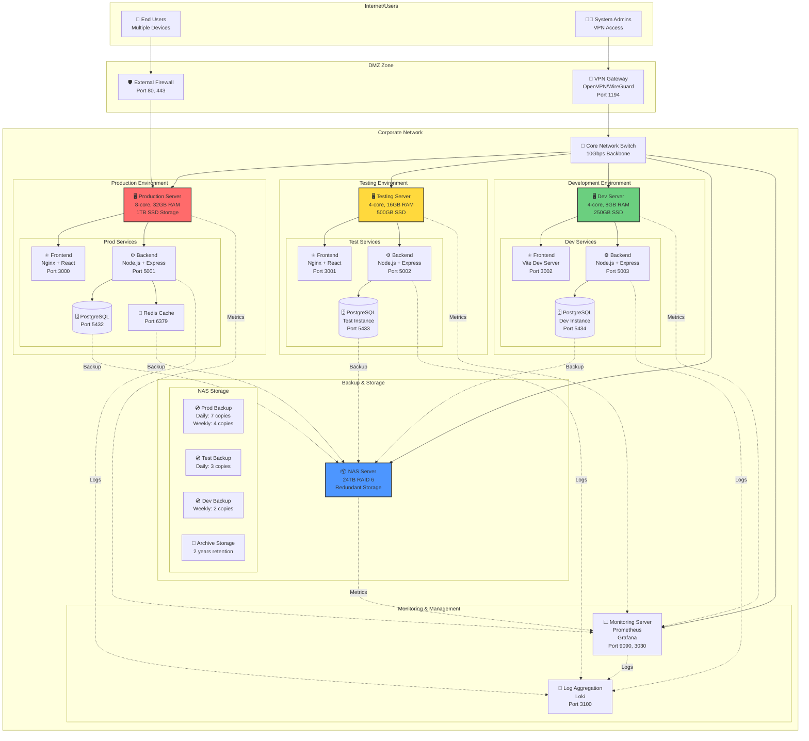

---

## 2. Server Specifications & Network Configuration

### Physical Server Details

#### Production Server
```
Model: Dell PowerEdge R750 (atau setara)
Processor: 2x Intel Xeon (16-core total)
RAM: 32GB DDR4
Storage: 1TB NVMe SSD (RAID 1) + 2TB SAS HDD (RAID 5)
Network: Dual 10Gbps Ethernet
OS: Ubuntu 22.04 LTS Server
Power: Dual 750W PSU with failover
BMC: iDRAC for remote management
```

**Network Configuration:**
```
Hostname: documan-prod-01
IP Address: 192.168.1.100/24
Gateway: 192.168.1.1
DNS: 8.8.8.8, 8.8.4.4
Management IP: 192.168.1.200 (IPMI)
```

#### Testing Server
```
Model: Dell PowerEdge R740 (atau setara)
Processor: 2x Intel Xeon (8-core total)
RAM: 16GB DDR4
Storage: 500GB NVMe SSD (RAID 1)
Network: Dual 1Gbps Ethernet
OS: Ubuntu 22.04 LTS Server
Power: Dual 500W PSU
BMC: iDRAC for remote management
```

**Network Configuration:**
```
Hostname: documan-test-01
IP Address: 192.168.1.101/24
Gateway: 192.168.1.1
DNS: 8.8.8.8, 8.8.4.4
Management IP: 192.168.1.201 (IPMI)
```

#### Development Server
```
Model: Dell PowerEdge R640 (atau setara)
Processor: 2x Intel Xeon (8-core total)
RAM: 8GB DDR4
Storage: 250GB NVMe SSD
Network: Dual 1Gbps Ethernet
OS: Ubuntu 22.04 LTS Server
Power: Single 500W PSU
BMC: iDRAC for remote management
```

**Network Configuration:**
```
Hostname: documan-dev-01
IP Address: 192.168.1.102/24
Gateway: 192.168.1.1
DNS: 8.8.8.8, 8.8.4.4
Management IP: 192.168.1.202 (IPMI)
```

#### NAS Server
```
Model: QNAP TS-432PX (atau setara)
Storage Capacity: 24TB (4x 6TB HDD in RAID 6)
Processor: Intel Celeron (4-core)
RAM: 16GB DDR4
Network: Dual 10Gbps Ethernet
Power: Dual 400W PSU
Management: Web interface + SSH
```

**Network Configuration:**
```
Hostname: documan-nas-01
IP Address: 192.168.1.150/24
Management IP: 192.168.1.150
Gateway: 192.168.1.1
DNS: 8.8.8.8, 8.8.4.4
```

---

## 3. Network Architecture

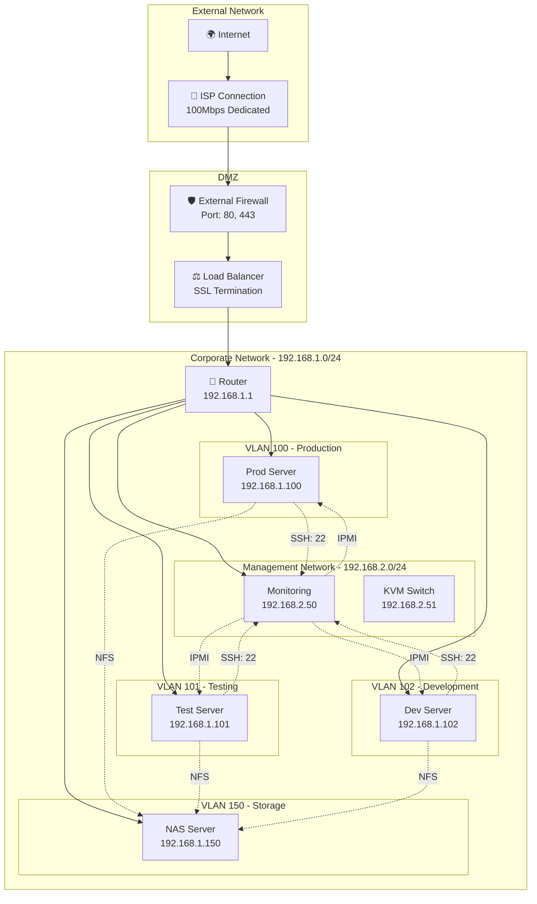

---

## 4. Production Environment Topology

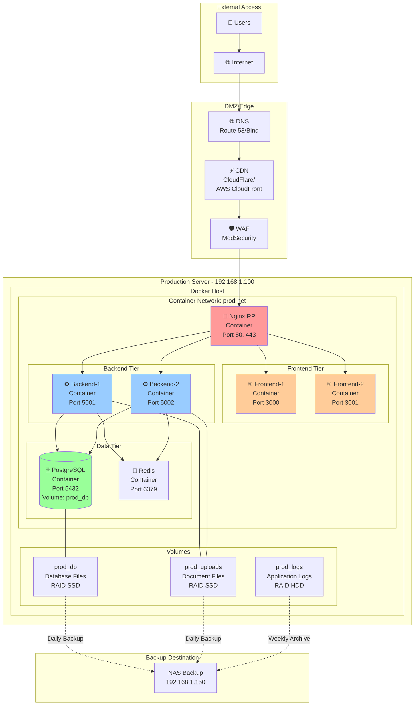

---

## 5. Testing Environment Topology

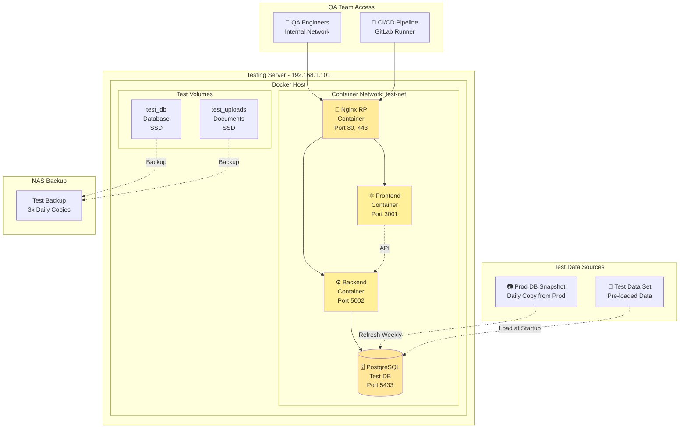

---

## 6. Development Environment Topology

```mermaid
graph TB
    subgraph "Developer Workstations"
        Dev1[💻 Dev 1<br/>Git Clone<br/>SSH Access]
        Dev2[💻 Dev 2<br/>Git Clone<br/>SSH Access]
        Dev3[💻 Dev 3<br/>Git Clone<br/>SSH Access]
    end
    
    subgraph "VPN/Remote Access"
        VPN[🔐 VPN Gateway<br/>OpenVPN<br/>192.168.1.254]
    end
    
    subgraph "Development Server - 192.168.1.102"
        subgraph "SSH/Remote Development"
            SSH[🔑 SSH Service<br/>Port 22<br/>Key-based Auth]
            Git[📦 Git Server<br/>GitLab/Gitea<br/>Port 3000]
        end
        
        subgraph "Docker Host"
            subgraph "Container Network: dev-net"
                FE_D[⚛️ Frontend<br/>Vite Dev<br/>Port 3002]
                
                BE_D[⚙️ Backend<br/>Nodemon<br/>Port 5003]
                
                DB_D[(🗄️ PostgreSQL<br/>Dev DB<br/>Port 5434)]
            end
            
            subgraph "Dev Volumes"
                V_Code[/app/code<br/>Source Code<br/>Git Repo]
                V_DB_D[dev_db<br/>Database]
            end
        end
    end
    
    subgraph "Shared Storage"
        DevShare[📁 Dev Share<br/>Source Code<br/>NFS Mount]
    end
    
    Dev1 --> VPN
    Dev2 --> VPN
    Dev3 --> VPN
    
    VPN --> SSH
    SSH --> Git
    Git --> V_Code
    
    V_Code --> FE_D
    V_Code --> BE_D
    
    BE_D --> DB_D
    FE_D -.API Calls.-> BE_D
    
    V_Code -.Sync.-> DevShare
    
    SSH -.Remote Commands.-> FE_D
    SSH -.Remote Commands.-> BE_D
    SSH -.Remote Debugging.-> DB_D
    
    style SSH fill:#99ff99
    style VPN fill:#99ff99
    style V_Code fill:#ccffcc
```

---

## 7. Backup Strategy - NAS Integration

```mermaid
graph TD
    subgraph "Production Backup Schedule"
        ProdDB[PostgreSQL DB<br/>Prod Server]
        ProdFiles[Uploaded Files<br/>Prod Server]
        
        Backup1[🔄 Hourly Snapshot<br/>Automated]
        Backup2[📅 Daily Full Backup<br/>2:00 AM]
        Backup3[📅 Weekly Archive<br/>Sunday Midnight]
        Backup4[📅 Monthly Offsite<br/>1st of Month]
    end
    
    subgraph "NAS Storage - 24TB RAID 6"
        NAS_Prod[Production Backups<br/>- 7x Daily (1 week)<br/>- 4x Weekly (1 month)<br/>- 12x Monthly (1 year)]
        
        NAS_Test[Testing Backups<br/>- 3x Daily<br/>- Weekly from Prod]
        
        NAS_Dev[Dev Backups<br/>- Weekly only]
        
        NAS_Archive[Archive Storage<br/>2-year retention<br/>Tape backup]
    end
    
    subgraph "Offsite Backup"
        Cloud[☁️ Cloud Backup<br/>AWS S3 Glacier<br/>Monthly sync]
    end
    
    ProdDB --> Backup1
    ProdFiles --> Backup1
    
    Backup1 --> NAS_Prod
    Backup2 --> NAS_Prod
    Backup3 --> NAS_Prod
    Backup4 --> Cloud
    
    Backup2 -.Copy.-> NAS_Test
    
    NAS_Prod -.Monthly.-> NAS_Archive
    NAS_Archive -.Upload.-> Cloud
    
    style NAS_Prod fill:#ff9999,stroke:#333,stroke-width:2px
    style NAS_Test fill:#ffcc99,stroke:#333,stroke-width:2px
    style NAS_Archive fill:#4d96ff,stroke:#333,stroke-width:2px
    style Cloud fill:#a0a0ff,stroke:#333,stroke-width:2px
```

**Backup Policy Details:**

| Environment | Frequency | Retention | Method | RPO | RTO |
|------------|-----------|-----------|--------|-----|-----|
| **Production** | Hourly | 1 week | Snapshot | 1 hour | 15 min |
| **Production** | Daily | 1 month | Full Backup | 24 hours | 30 min |
| **Production** | Weekly | 1 year | Archive | 7 days | 1 hour |
| **Production** | Monthly | 2 years | Offsite | 30 days | 2 hours |
| **Testing** | Daily | 1 week | From Prod DB | 24 hours | 30 min |
| **Development** | Weekly | 1 month | Snapshot | 7 days | 1 hour |

---

## 8. SSH Remote Development Access

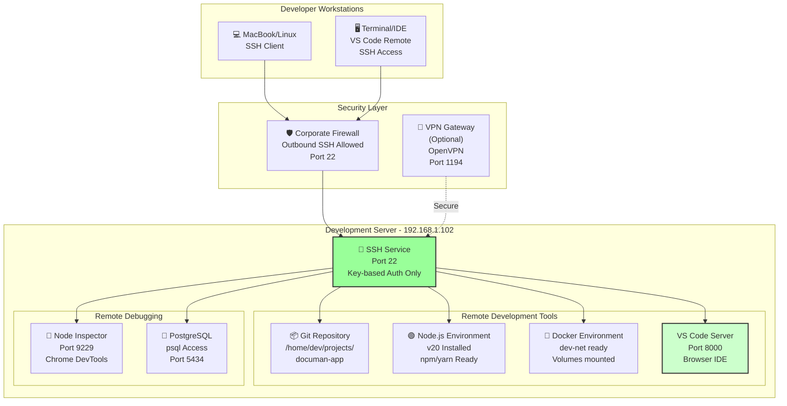

**SSH Configuration:**

```bash
# ~/.ssh/config pada workstation developer

Host documan-dev
    HostName 192.168.1.102
    User dev
    Port 22
    IdentityFile ~/.ssh/id_rsa_documan
    ServerAliveInterval 60
    ServerAliveCountMax 10
    
# Untuk VS Code Remote SSH
Host documan-prod
    HostName 192.168.1.100
    User deploy
    Port 22
    IdentityFile ~/.ssh/id_rsa_documan
    
Host documan-test
    HostName 192.168.1.101
    User deploy
    Port 22
    IdentityFile ~/.ssh/id_rsa_documan
```

**Remote Development Commands:**

```bash
# SSH ke Dev Server
ssh documan-dev

# Edit file dari IDE lokal (VS Code)
code --remote ssh-remote+documan-dev /app/code

# Remote Git operations
ssh documan-dev git -C /app/code status

# Remote Docker commands
ssh documan-dev docker-compose -f /app/dev-compose.yml logs -f

# Remote debugging Node.js
ssh -L 9229:localhost:9229 documan-dev node --inspect=0.0.0.0:9229 src/app.js

# Remote database access
ssh -L 5434:localhost:5434 documan-dev psql -U dev -d documan_dev -h localhost
```

---

## 9. Monitoring & Management Infrastructure

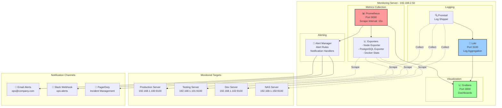

**Monitoring Metrics:**

```
System Metrics:
- CPU Usage (per core)
- Memory Usage & Swap
- Disk I/O & Space
- Network Throughput

Container Metrics:
- Container Count
- Resource Usage
- Restart Events
- Build Times

Application Metrics:
- Request Rate
- Response Time
- Error Rate
- Active Connections

Database Metrics:
- Connection Pool
- Query Time
- Cache Hit Rate
- Replication Lag

Backup Metrics:
- Backup Duration
- Backup Size
- Restore Time
- Deduplication Ratio
```

---

## 10. Network Diagram - Complete Infrastructure

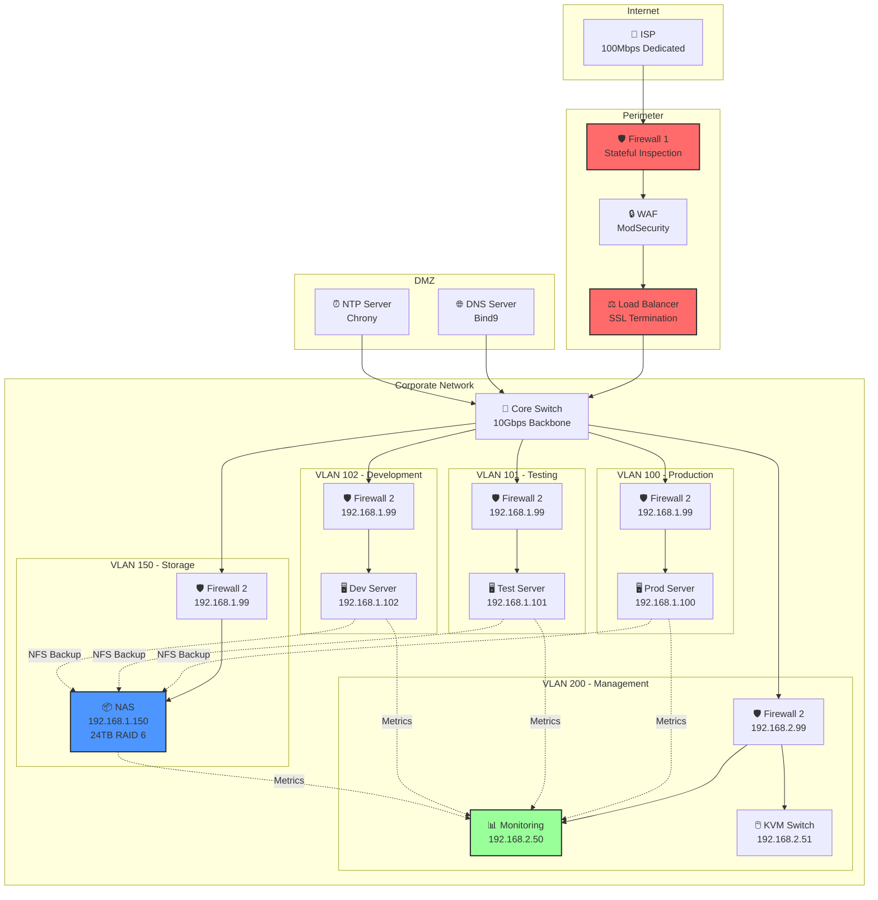

---

## 11. Storage Architecture

```mermaid
graph TB
    subgraph "Production Server Storage"
        SSD1[🔴 1TB NVMe SSD<br/>RAID 1<br/>OS + Containers]
        HDD1[🔵 2TB SAS HDD<br/>RAID 5<br/>Database + Logs]
        
        Mount1["/var/lib/docker<br/>Container data"]
        Mount2["/data/postgres<br/>Database"]
        Mount3["/data/uploads<br/>Documents"]
    end
    
    subgraph "NAS Storage - RAID 6"
        NAS_Hot[🟢 Hot Storage<br/>8TB - RAID 6<br/>Backups (last 30 days)<br/>Fast Recovery]
        
        NAS_Warm[🟡 Warm Storage<br/>8TB - RAID 6<br/>Archive (6-12 months)<br/>Planned Recovery]
        
        NAS_Cold[🔵 Cold Storage<br/>8TB - External HDD<br/>Archive (1-2 years)<br/>Offsite/Vault]
    end
    
    subgraph "Data Flow"
        Daily[📅 Daily Backup<br/>Incremental]
        Weekly[📅 Weekly Full<br/>Deduplication]
        Monthly[📅 Monthly Archive<br/>Compression]
    end
    
    SSD1 --> Mount1
    HDD1 --> Mount2
    HDD1 --> Mount3
    
    Mount1 -.Backup.-> Daily
    Mount2 -.Backup.-> Daily
    Mount3 -.Backup.-> Daily
    
    Daily --> NAS_Hot
    Weekly --> NAS_Hot
    Monthly --> NAS_Warm
    Monthly -.Copy.-> NAS_Cold
    
    style SSD1 fill:#ff9999
    style HDD1 fill:#99ccff
    style NAS_Hot fill:#99ff99,stroke:#333,stroke-width:2px
    style NAS_Warm fill:#ffff99,stroke:#333,stroke-width:2px
    style NAS_Cold fill:#ccccff,stroke:#333,stroke-width:2px
```

---

## 12. Deployment & CI/CD Pipeline

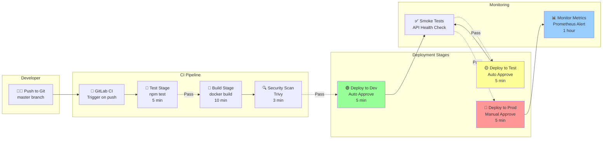

---

## 13. Disaster Recovery Plan

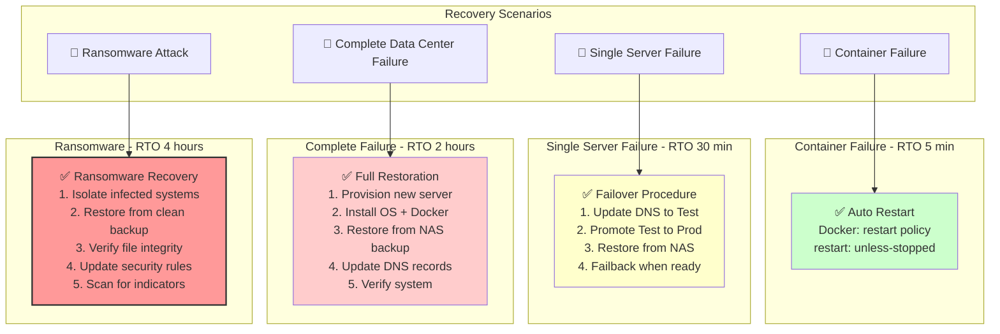

**Recovery Procedures:**

```bash
# 1. Point-in-Time Recovery
docker exec -i postgres psql -U admin < /backup/prod_db_2024-12-01.sql

# 2. Full Container Stack Recovery
cd /app/documan
docker-compose -f docker-compose.prod.yml down
rm -rf data/*
cp -r /backup/prod_data/* data/
docker-compose -f docker-compose.prod.yml up -d

# 3. Database Consistency Check
docker exec postgres pg_dump -U admin --check documan_prod > /dev/null

# 4. Backup Verification
md5sum /backup/prod_db_*.sql | md5sum -c backup.checksums
```

---

## 14. Production to Staging Cloning Strategy

### Overview - Data Cloning Architecture

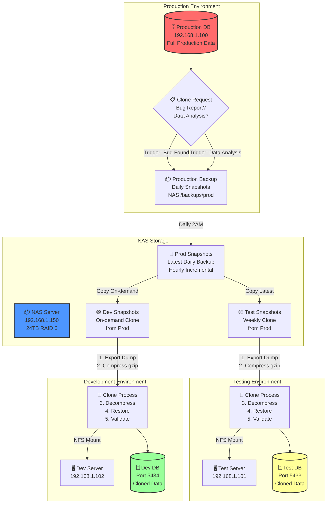

### Cloning Process Flow

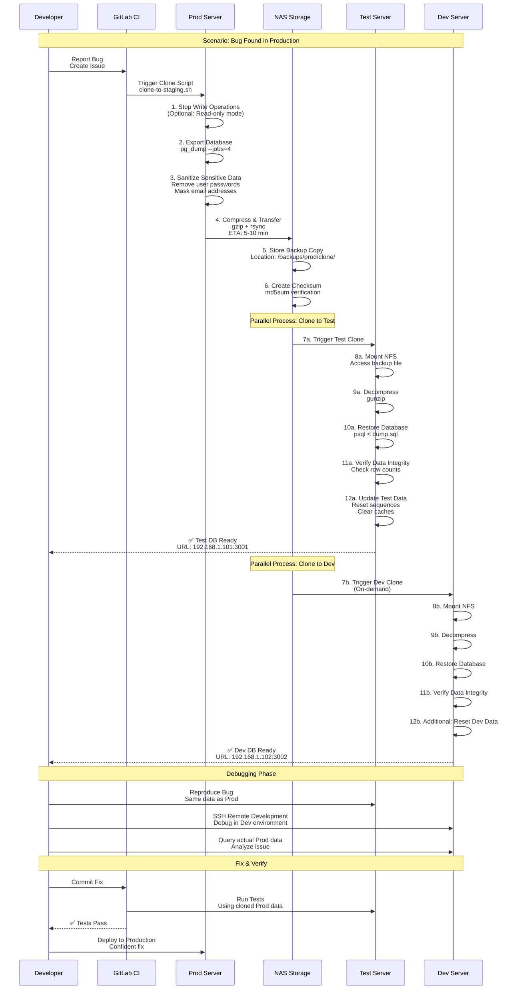

### Cloning Scenarios & Triggers

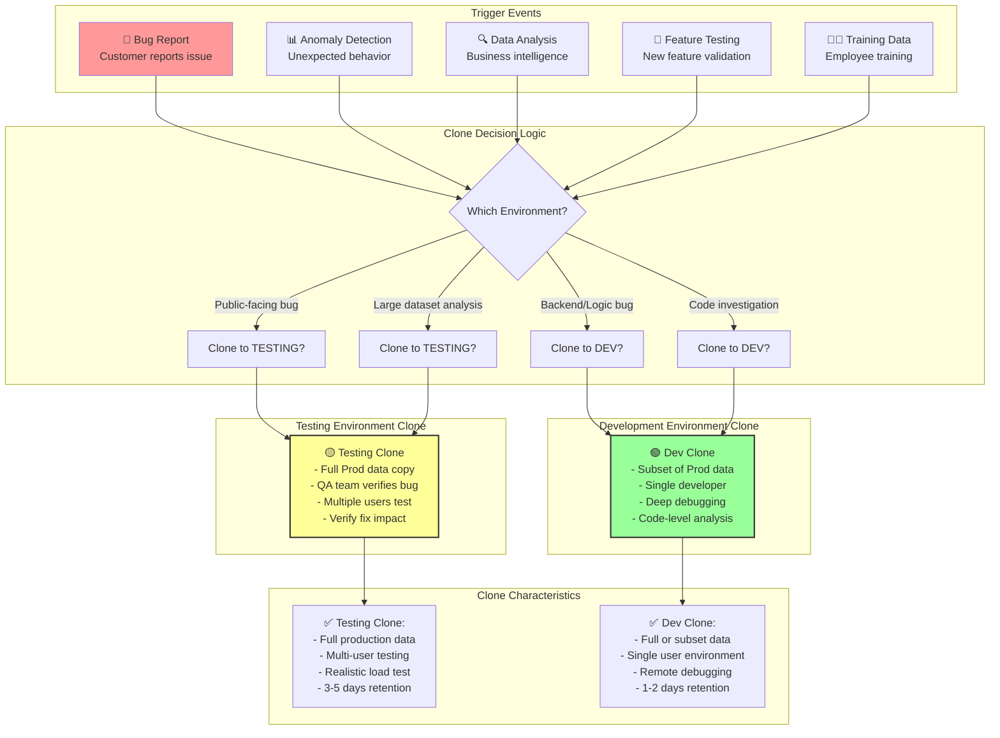

### Clone Automation Scripts

**File: `/opt/scripts/clone-to-staging.sh`**

```bash
#!/bin/bash
set -e

# Clone Production to Testing/Development Environments
# Usage: clone-to-staging.sh [target] [sanitize]
# target: testing | development | all
# sanitize: yes | no (default: yes)

TARGET=${1:-all}
SANITIZE=${2:-yes}

PROD_HOST="192.168.1.100"
TEST_HOST="192.168.1.101"
DEV_HOST="192.168.1.102"
NAS_HOST="192.168.1.150"

DB_USER="admin"
DB_PASSWORD="${DB_PASSWORD}"
DB_NAME="documan_prod"

NAS_BACKUP_PATH="/mnt/nfs/backups/prod/clone"
TIMESTAMP=$(date +%Y%m%d_%H%M%S)
BACKUP_FILE="documan_prod_clone_${TIMESTAMP}.sql"
BACKUP_COMPRESSED="${BACKUP_FILE}.gz"

echo "========================================"
echo "Production to Staging Clone Script"
echo "========================================"
echo "Target: $TARGET"
echo "Sanitize: $SANITIZE"
echo "Timestamp: $TIMESTAMP"
echo ""

# Step 1: Export Production Database
echo "[1/7] Exporting Production Database..."
ssh deploy@${PROD_HOST} << EOF
    set -e
    
    # Set to read-only mode (optional)
    psql -U ${DB_USER} -d ${DB_NAME} -c "SET default_transaction_read_only = on;"
    
    # Export with parallel jobs
    pg_dump -U ${DB_USER} \
        --jobs=4 \
        --format=plain \
        --compress=9 \
        --no-privileges \
        ${DB_NAME} > /tmp/${BACKUP_COMPRESSED}
    
    # Reset read-only mode
    psql -U ${DB_USER} -d ${DB_NAME} -c "SET default_transaction_read_only = off;"
    
    echo "Export completed: /tmp/${BACKUP_COMPRESSED}"
EOF

echo "[2/7] Copying to NAS..."
ssh deploy@${PROD_HOST} \
    "rsync -avz --progress /tmp/${BACKUP_COMPRESSED} nfs://${NAS_BACKUP_PATH}/" || true

# Step 2: Sanitize Data (Optional)
if [ "$SANITIZE" = "yes" ]; then
    echo "[3/7] Sanitizing Sensitive Data..."
    
    # Create sanitization SQL script
    cat > /tmp/sanitize.sql << 'SANITIZE_EOF'
-- Sanitize Production Data
UPDATE users 
SET password = '$2b$10$sanitized_password_hash',
    email = CONCAT('user', id, '@example.com'),
    phone = '0000000000'
WHERE role NOT IN ('admin');

-- Mask document content paths
UPDATE documents 
SET file_path = CONCAT('/uploads/doc_', id, '_sanitized.pdf');

-- Clear sensitive activity logs
DELETE FROM activity_logs 
WHERE action IN ('USER_PASSWORD_RESET', 'SENSITIVE_EXPORT');

-- Clear temporary tables
TRUNCATE temp_sessions;
SANITIZE_EOF

    ssh deploy@${TEST_HOST} "psql -U ${DB_USER} -d documan_test -f /tmp/sanitize.sql" || true
else
    echo "[3/7] Skipping data sanitization"
fi

# Step 3: Clone to Testing Environment
if [ "$TARGET" = "testing" ] || [ "$TARGET" = "all" ]; then
    echo "[4/7] Cloning to Testing Environment..."
    
    ssh deploy@${TEST_HOST} << EOF
        set -e
        
        # Stop containers
        docker-compose -f /app/test-compose.yml down || true
        
        # Mount NFS
        mkdir -p /mnt/nfs/backups
        mount -t nfs ${NAS_HOST}:/backups /mnt/nfs/backups || true
        
        # Decompress
        gunzip -kf /mnt/nfs/backups/prod/clone/${BACKUP_COMPRESSED}
        
        # Drop existing database
        dropdb --if-exists documan_test || true
        createdb documan_test
        
        # Restore
        psql -U ${DB_USER} -d documan_test < \
            /mnt/nfs/backups/prod/clone/${BACKUP_FILE}
        
        # Reset sequences
        psql -U ${DB_USER} -d documan_test -c "SELECT setval(
            'users_id_seq', 
            (SELECT MAX(id) FROM users) + 1
        );"
        
        # Verify restore
        ROWS=\$(psql -U ${DB_USER} -d documan_test -t -c "SELECT COUNT(*) FROM users;")
        echo "✅ Testing DB restored with \$ROWS user records"
        
        # Start containers
        docker-compose -f /app/test-compose.yml up -d
        
        # Health check
        sleep 5
        curl -f http://localhost:3001/api/health || exit 1
        echo "✅ Testing environment health check passed"
EOF
fi

# Step 4: Clone to Development Environment (On-demand)
if [ "$TARGET" = "development" ] || [ "$TARGET" = "all" ]; then
    echo "[5/7] Cloning to Development Environment..."
    
    ssh deploy@${DEV_HOST} << EOF
        set -e
        
        # Development may have lower resources
        # Only clone last 1 month of data
        
        docker-compose -f /app/dev-compose.yml down || true
        
        # Mount NFS
        mkdir -p /mnt/nfs/backups
        mount -t nfs ${NAS_HOST}:/backups /mnt/nfs/backups || true
        
        # Decompress
        gunzip -kf /mnt/nfs/backups/prod/clone/${BACKUP_COMPRESSED}
        
        # Drop existing database
        dropdb --if-exists documan_dev || true
        createdb documan_dev
        
        # Restore
        psql -U ${DB_USER} -d documan_dev < \
            /mnt/nfs/backups/prod/clone/${BACKUP_FILE}
        
        # Reset Dev sequences
        psql -U ${DB_USER} -d documan_dev << SQL
            SELECT setval('users_id_seq', (SELECT MAX(id) FROM users) + 1);
            SELECT setval('documents_id_seq', (SELECT MAX(id) FROM documents) + 1);
SQL
        
        # Verify
        ROWS=\$(psql -U ${DB_USER} -d documan_dev -t -c "SELECT COUNT(*) FROM documents;")
        echo "✅ Dev DB restored with \$ROWS documents"
        
        # Start containers
        docker-compose -f /app/dev-compose.yml up -d
        
        # Health check
        sleep 5
        curl -f http://localhost:3002/api/health || exit 1
        echo "✅ Development environment health check passed"
EOF
fi

# Step 5: Verification
echo "[6/7] Verifying Clone Integrity..."
ssh deploy@${TEST_HOST} "psql -U ${DB_USER} -d documan_test -c \
    \"SELECT COUNT(*) as user_count FROM users; \
     SELECT COUNT(*) as doc_count FROM documents; \
     SELECT COUNT(*) as activity_count FROM activity_logs;\"" || true

# Step 6: Update Documentation
echo "[7/7] Updating Clone Status..."
cat > /tmp/clone_status.txt << EOF
Clone Completed: $TIMESTAMP
Source: Production (192.168.1.100)
Targets: $TARGET
Backup File: $BACKUP_FILE
Backup Location: $NAS_BACKUP_PATH
Data Sanitized: $SANITIZE
Status: ✅ SUCCESS

Testing Environment:
  - Database: documan_test
  - Port: 5433
  - URL: http://192.168.1.101:3001

Development Environment:
  - Database: documan_dev
  - Port: 5434
  - URL: http://192.168.1.102:3002

Next Steps:
1. QA team: Start bug reproduction on Testing
2. Developers: SSH to Dev for remote debugging
3. Compare Prod vs Stage data if needed
EOF

echo ""
echo "========================================"
echo "Clone completed successfully!"
echo "========================================"
cat /tmp/clone_status.txt
```

### Clone Scheduler - Automated Weekly Clone

**File: `/etc/cron.d/documan-clone`**

```bash
# Automated cloning schedule

# Every Sunday 1 AM - Clone to Testing (full production copy)
0 1 * * 0 deploy /opt/scripts/clone-to-staging.sh testing yes >> /var/log/clone-testing.log 2>&1

# Manual trigger for Development clones (on-demand)
# Run via GitLab CI when bug reported:
# curl -X POST http://192.168.1.102/webhook/clone \
#   -H "Authorization: Bearer $TOKEN"
```

### Data Retention Policy

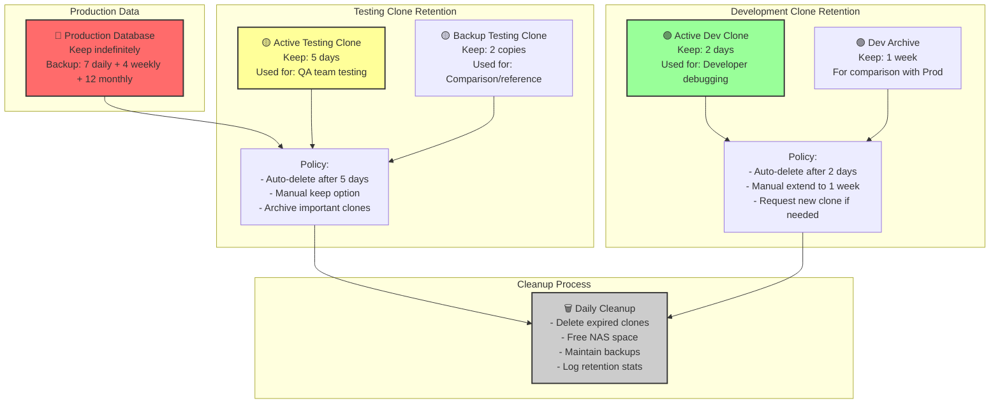

### Clone Workflow - Bug Analysis Example

```mermaid
graph TD
    subgraph "Day 1: Bug Reported"
        Customer["👥 Customer Report<br/>Document upload fails<br/>for file > 100MB"]
        
        Ticket["🎫 Create GitHub Issue<br/>#4521: Large file upload bug"]
        
        Trigger["🔄 Trigger Clone<br/>Automation starts"]
    end
    
    subgraph "Day 1: Testing Phase"
        CloneTest["🟡 Clone to Testing<br/>Time: 15 minutes<br/>Full Prod DB copied"]
        
        QATest["🧪 QA Reproduction<br/>- Test same scenario<br/>- Confirm bug exists<br/>- Document steps"]
        
        QAAnalysis["📊 QA Analysis<br/>- Check error logs<br/>- Review file handling<br/>- Check disk space"]
    end
    
    subgraph "Day 2: Development Phase"
        CloneDev["🟢 Clone to Development<br/>Time: 15 minutes<br/>On-demand"]
        
        DevDebug["🐛 Developer Debug<br/>- SSH remote access<br/>- Inspect actual data<br/>- Query customer files<br/>- Check code logic"]
        
        RootCause["🔍 Root Cause<br/>Identified: Nginx upload limit<br/>was set to 50MB<br/>Needs update"]
    end
    
    subgraph "Day 3: Fix & Verify"
        CodeFix["💻 Code Fix<br/>- Update nginx.conf<br/>- Increase client_max_body_size<br/>- Add logging"]
        
        TestFix["✅ Test Fix<br/>- Deploy to Testing env<br/>- Run with cloned data<br/>- Upload 200MB file<br/>- Success!"]
        
        Verify["🔎 Verify Impact<br/>- Check Prod data<br/>- No data loss<br/>- Backward compatible"]
    end
    
    subgraph "Day 4: Production"
        Deploy["🚀 Deploy to Prod<br/>- Confident fix<br/>- Minimal downtime<br/>- Verified solution"]
        
        Confirm["✅ Customer Confirm<br/>Upload working<br/>File > 100MB accepted"]
    end
    
    Customer --> Ticket
    Ticket --> Trigger
    
    Trigger --> CloneTest
    CloneTest --> QATest
    QATest --> QAAnalysis
    
    QAAnalysis --> CloneDev
    CloneDev --> DevDebug
    DevDebug --> RootCause
    
    RootCause --> CodeFix
    CodeFix --> TestFix
    TestFix --> Verify
    
    Verify --> Deploy
    Deploy --> Confirm
    
    style Trigger fill:#4d96ff,stroke:#333,stroke-width:2px
    style QATest fill:#ffff99,stroke:#333,stroke-width:2px
    style DevDebug fill:#99ff99,stroke:#333,stroke-width:2px
    style Deploy fill:#ff6b6b,stroke:#333,stroke-width:2px
    style Confirm fill:#99ff99,stroke:#333,stroke-width:2px
```

### Monitoring Clone Performance

| Metric | Target | Tool |
|--------|--------|------|
| **Clone Duration** | < 15 min | Prometheus |
| **Backup Size** | < 5GB | df/du |
| **Decompression** | < 5 min | time command |
| **Restore Time** | < 5 min | pg_restore stats |
| **Data Integrity** | 100% | md5sum verification |
| **NAS Space Used** | < 80% | QNAP monitoring |

### Clone Automation via GitLab CI

**File: `.gitlab-ci.yml` (snippet)**

```yaml
clone_to_testing:
  stage: staging
  when: manual
  script:
    - ssh deploy@192.168.1.100 /opt/scripts/clone-to-staging.sh testing yes
  only:
    - master
  tags:
    - production

clone_to_development:
  stage: staging
  when: manual
  script:
    - ssh deploy@192.168.1.102 /opt/scripts/clone-to-staging.sh development yes
  only:
    - master
  tags:
    - production

# Scheduled daily clone to Testing (7 PM)
scheduled_clone_testing:
  stage: staging
  script:
    - ssh deploy@192.168.1.100 /opt/scripts/clone-to-staging.sh testing yes
  only:
    - schedules
  tags:
    - production
```

---

## 15. Implementation Timeline

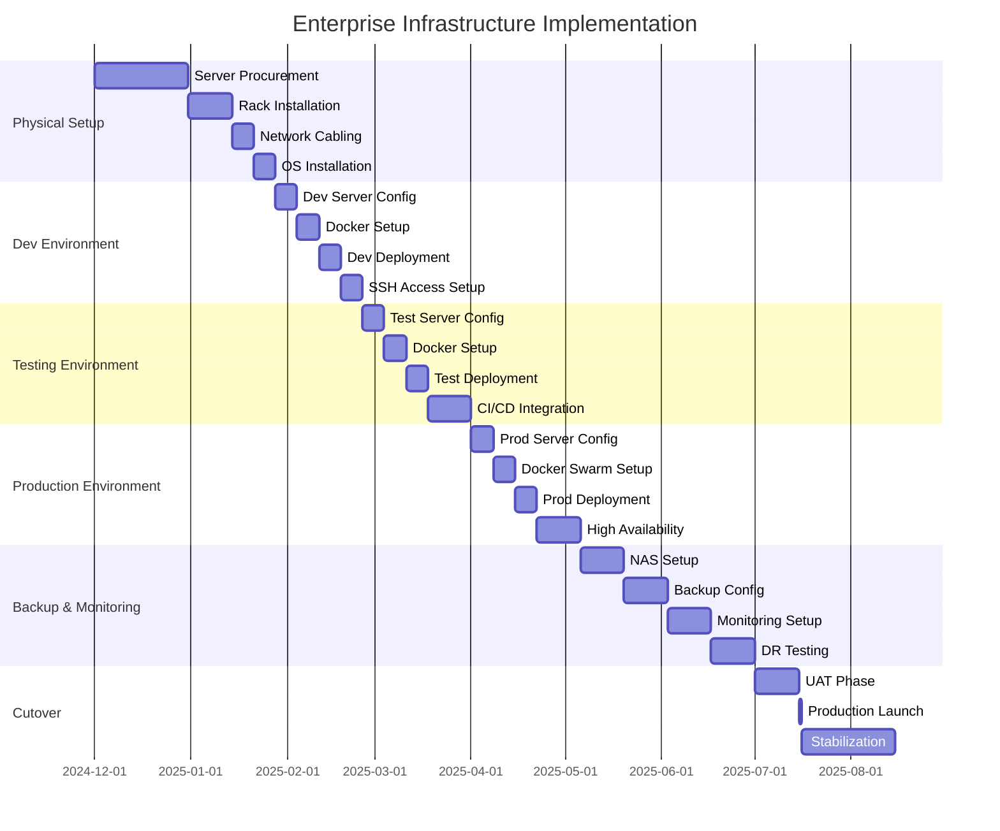

---

## 15. Security Architecture

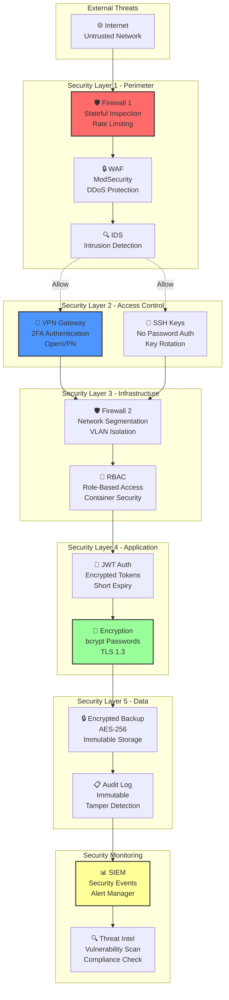

---

## 16. Cost Estimation

### Hardware Investment

| Item | Model | Qty | Unit Cost | Total |
|------|-------|-----|-----------|-------|
| Production Server | Dell R750 | 1 | $8,000 | $8,000 |
| Testing Server | Dell R740 | 1 | $6,000 | $6,000 |
| Development Server | Dell R640 | 1 | $4,500 | $4,500 |
| NAS 24TB | QNAP TS-432PX | 1 | $3,500 | $3,500 |
| Network Switch | Cisco C9300 | 1 | $5,000 | $5,000 |
| Firewall | Cisco ASA 5516-X | 1 | $4,000 | $4,000 |
| UPS 10kVA | APC | 1 | $3,000 | $3,000 |
| Rack & Accessories | 42U Rack | 1 | $2,000 | $2,000 |
| **Subtotal Hardware** | | | | **$36,000** |

### Software & Services (Annual)

| Service | Cost | Notes |
|---------|------|-------|
| OS Licenses | $0 | Ubuntu LTS - Free |
| Docker Licenses | $0 | Docker - Free Community |
| Monitoring Software | $0 | Prometheus/Grafana - Free |
| Backup Software | $2,000 | Veeam/Bacula - Optional |
| SSL Certificates | $500 | Let's Encrypt - Free, or paid |
| Support & Training | $3,000 | Annual support contract |
| **Subtotal Software** | **$5,500** | |

### Operational Costs (Annual)

| Item | Cost | Notes |
|------|------|-------|
| Electricity | $4,000 | ~40kW peak, 70% avg |
| Internet Connectivity | $2,400 | 100Mbps dedicated |
| Cooling | $2,000 | In-rack AC units |
| Maintenance | $5,000 | Hardware maintenance |
| Staffing (1 FTE DevOps) | $60,000 | Senior engineer |
| **Subtotal Operations** | **$73,400** | |

### 5-Year TCO

```
Year 1: $36,000 (hardware) + $5,500 (software) + $73,400 (ops) = $114,900
Year 2-5: $5,500 + $73,400 = $78,900/year × 4 = $315,600

Total 5-Year TCO: $430,500

Break-even vs AWS/Azure: ~2.5 years (depending on workload)
Cost per user/month: ~$40-50 (100 concurrent users)
```

---

## 17. Operational Runbooks

### Daily Operations

**Morning Checklist (9:00 AM):**
```bash
# Check system health
curl -s http://192.168.1.100/api/health | jq

# Verify backups completed
ls -lh /nas/backups/prod/ | tail -5

# Check disk usage
ssh documan-prod df -h /

# Review monitoring alerts
# Open Grafana: http://192.168.2.50:3000
```

**Weekly Tasks (Monday):**
```bash
# Full backup test
/opt/backup/test-restore.sh prod

# Review logs for errors
journalctl -u documan-prod -n 100 --grep ERROR

# Update monitoring dashboards
# Check: Network traffic, error rates, response times
```

**Monthly Tasks (1st of Month):**
```bash
# Database optimization
ssh documan-prod docker exec postgres vacuumdb -U admin -d documan_prod -z

# Security patching
ssh documan-prod sudo apt update && sudo apt upgrade -y

# Capacity planning
df -h on all servers
du -sh /nas/backups/*
```

### Incident Response

**Database Outage (RTO 15 min):**
```bash
# 1. Check if container is running
docker ps | grep postgres

# 2. Check logs
docker logs <container-id> --tail 50

# 3. Restart container
docker restart <container-id>

# 4. Verify recovery
docker exec postgres pg_isready -U admin

# 5. Run consistency check
docker exec postgres psql -U admin -d documan_prod -c "REINDEX DATABASE documan_prod;"
```

**Out of Disk Space (RTO 5 min):**
```bash
# 1. Find large files
find /data -type f -size +100M -exec ls -lh {} \;

# 2. Clean old logs
rm /data/logs/archive/*.log*

# 3. Docker cleanup
docker system prune -a --volumes

# 4. Verify space
df -h
```

---

## 18. Compliance & Standards

### Implemented Standards

- ✅ **ISO 27001** - Information Security Management
- ✅ **ISO 22301** - Business Continuity Management
- ✅ **SOC 2 Type II** - Security, Availability, Processing Integrity
- ✅ **NIST Cybersecurity Framework** - Risk Management
- ✅ **GDPR** - Data Protection & Privacy (if applicable)

### Audit Requirements

**Annual Audits:**
- Security penetration testing
- Disaster recovery exercises
- Backup restoration testing
- Compliance verification

**Quarterly Reviews:**
- Access control audit
- Backup integrity verification
- Performance baseline review
- Security patching status

---

## 19. Document Structure & References

```
📁 Project Documentation
├── 📄 ENTERPRISE-TOPOLOGY-PLAN.md (this file)
├── 📄 SYSTEM-TOPOLOGY.md (Current dev setup)
├── 📄 PRODUCTION-TOPOLOGY.md (Production on-premise)
├── 📄 SYSTEM-DOCUMENTATION.md (Full system docs)
│
├── 📁 Configuration
│   ├── docker-compose.prod.yml
│   ├── docker-compose.test.yml
│   ├── docker-compose.dev.yml
│   ├── nginx-prod.conf
│   ├── prometheus.yml
│   ├── backup-config.sh
│   └── firewall-rules.sh
│
├── 📁 Runbooks
│   ├── DEPLOY-RUNBOOK.md
│   ├── DISASTER-RECOVERY.md
│   ├── TROUBLESHOOTING.md
│   └── MAINTENANCE-SCHEDULE.md
│
├── 📁 Network
│   ├── network-diagram.drawio
│   ├── firewall-rules.txt
│   └── vlans-config.txt
│
└── 📁 Backup
    ├── backup-policy.txt
    ├── restore-procedures.sh
    └── verification-scripts.sh
```

---

## 20. Key Takeaways & Recommendations

### ✅ Implemented Best Practices

1. **Infrastructure as Code** - All configurations version-controlled
2. **Immutable Infrastructure** - Containers ensure consistency
3. **Infrastructure Monitoring** - Real-time visibility into all systems
4. **Automated Backups** - No manual backup processes
5. **Multi-environment Strategy** - Dev/Test/Prod separation
6. **Disaster Recovery Plan** - Tested recovery procedures
7. **Security Layering** - Defense in depth
8. **Remote Development** - SSH + VPN for safe remote access
9. **Centralized Storage** - NAS for unified backup management
10. **Compliance & Audit** - Immutable audit logs

### 🎯 Implementation Priorities

**Phase 1 (Months 1-2):** Infrastructure Setup
- Procure & install servers
- Network configuration
- OS installation

**Phase 2 (Months 2-3):** Development Environment
- Docker setup
- Git repositories
- SSH configuration

**Phase 3 (Months 3-4):** Testing Environment
- Testing infrastructure
- CI/CD pipeline
- Automated testing

**Phase 4 (Months 4-5):** Production Deployment
- Production setup
- High availability
- Load balancing

**Phase 5 (Months 5-6):** Backup & Monitoring
- NAS integration
- Backup automation
- Monitoring setup
- DR testing

### 📊 Success Metrics

| Metric | Target | Measurement |
|--------|--------|-------------|
| **Availability** | 99.95% | Monthly uptime |
| **RTO** | < 2 hours | Disaster recovery test |
| **RPO** | < 1 hour | Max data loss |
| **Backup Success** | 100% | Daily verification |
| **Restore Time** | < 30 min | Test restore |
| **Security** | Zero breaches | Annual audit |
| **Performance** | < 200ms | API response time |
| **Capacity** | 20% headroom | Monthly review |

---

## 21. Conclusion

Infrastruktur enterprise ini dirancang untuk mendukung Document Management System dengan:

✅ **Reliability** - Multi-environment dengan failover capability  
✅ **Scalability** - Server on-premise dengan expansion paths  
✅ **Security** - Multi-layer security dengan compliance standards  
✅ **Recoverability** - Comprehensive backup dengan NAS integration  
✅ **Maintainability** - SSH remote access untuk development  
✅ **Observability** - Full monitoring & alerting infrastructure  
✅ **Cost Efficiency** - 5-year TCO ~$430K vs cloud alternatives  

**Estimated Implementation:** 6-7 bulan dari procurement hingga go-live  
**Team Required:** 1-2 DevOps + 2-3 Developers  
**Expected Service Level:** 99.95% availability, < 2 hour RTO  

---

**Document Version:** 1.0  
**Last Updated:** 1 Desember 2025  
**Status:** Ready for Implementation Planning
