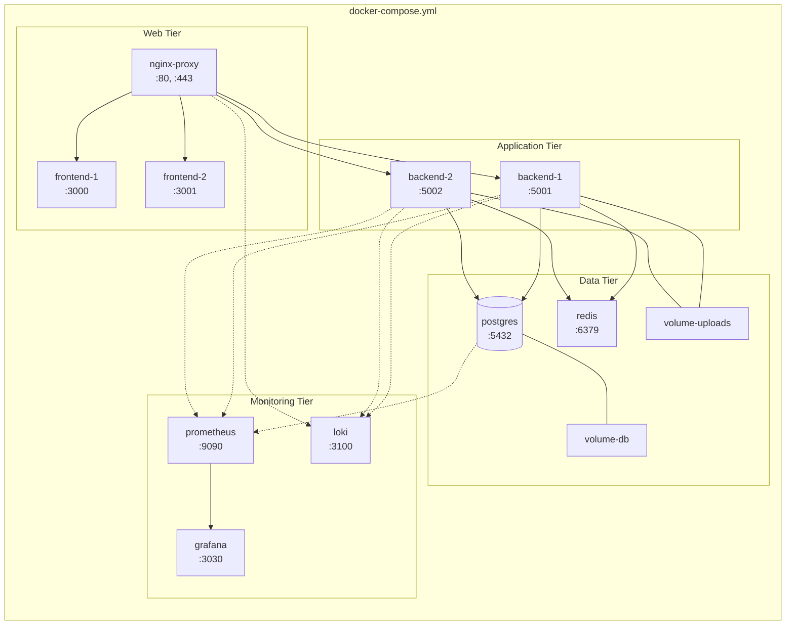
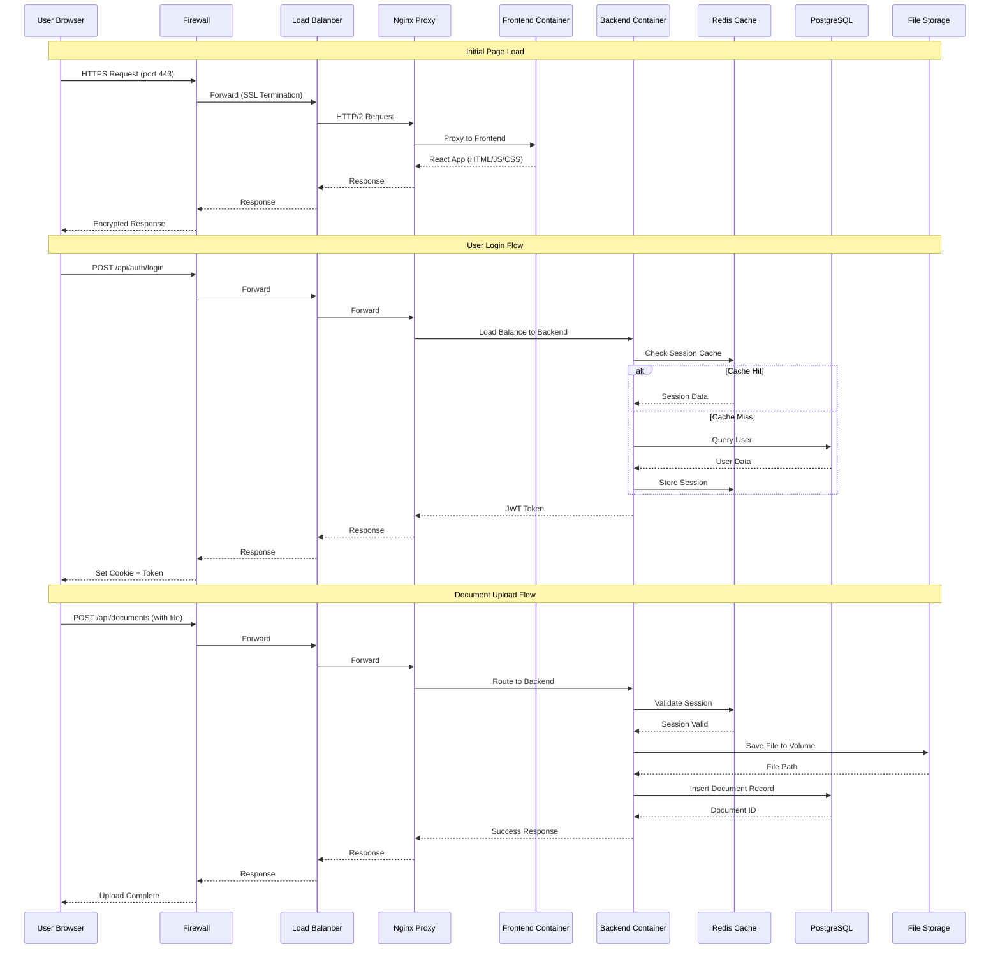
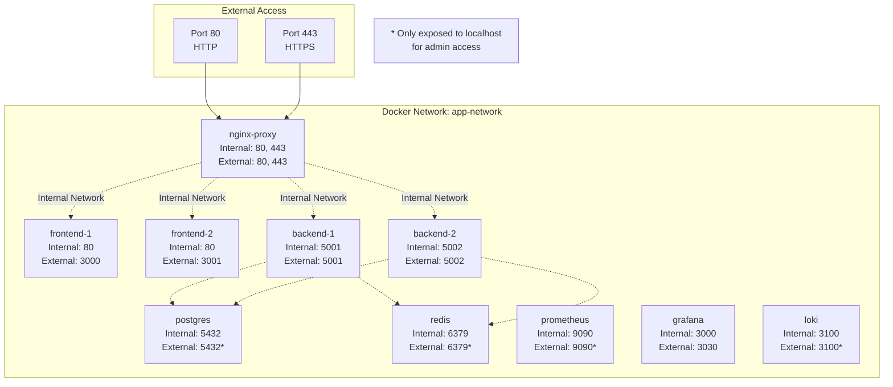
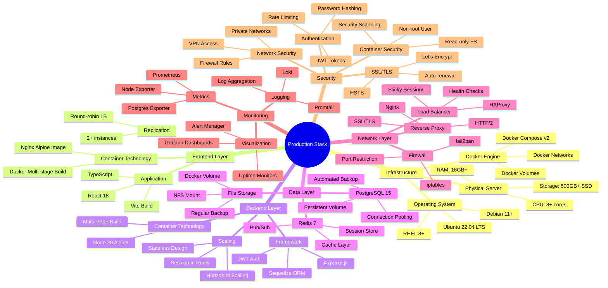
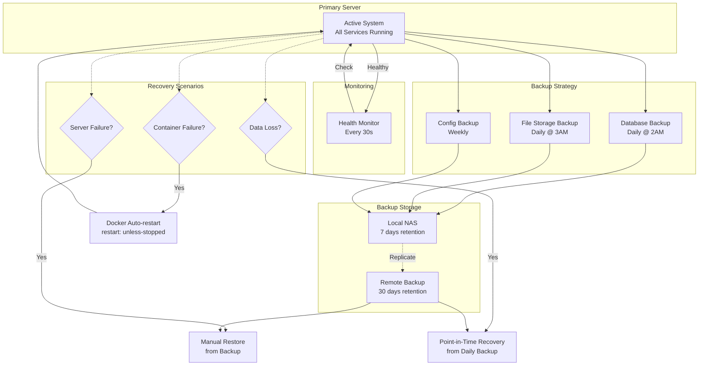

# Production Deployment Topology - Docker & On-Premise Server

## Deskripsi
Dokumentasi ini menjelaskan arsitektur production deployment untuk Document Management System menggunakan Docker containers pada server on-premise dengan konfigurasi high availability dan security best practices.

---

## 1. Production Architecture Diagram

```mermaid
graph TB
    subgraph "Internet"
        Users[👥 Users/Clients]
        Internet[🌐 Internet]
    end
    
    subgraph "DMZ Zone"
        Firewall[🛡️ Firewall<br/>Port 80, 443]
        LoadBalancer[⚖️ Load Balancer<br/>HAProxy/Nginx<br/>Port 80, 443]
    end
    
    subgraph "Production Server - On Premise"
        subgraph "Docker Host"
            subgraph "Reverse Proxy Container"
                NginxProd[🔄 Nginx<br/>Port 80, 443<br/>SSL/TLS]
            end
            
            subgraph "Application Containers"
                Frontend1[🖥️ Frontend Container 1<br/>Nginx + React Build<br/>Port 3000]
                Frontend2[🖥️ Frontend Container 2<br/>Nginx + React Build<br/>Port 3001]
                Backend1[⚙️ Backend Container 1<br/>Node.js + Express<br/>Port 5001]
                Backend2[⚙️ Backend Container 2<br/>Node.js + Express<br/>Port 5002]
            end
            
            subgraph "Database Container"
                PostgreSQL[(🗄️ PostgreSQL<br/>Port 5432<br/>+ Volume Mount)]
            end
            
            subgraph "Supporting Services"
                Redis[💾 Redis Cache<br/>Port 6379]
                FileStorage[📁 File Storage<br/>Volume Mount<br/>/uploads]
            end
        end
        
        subgraph "Monitoring & Logging"
            Prometheus[📊 Prometheus<br/>Port 9090]
            Grafana[📈 Grafana<br/>Port 3030]
            Loki[📝 Loki Logs<br/>Port 3100]
        end
    end
    
    subgraph "Backup Server"
        BackupStorage[💿 Backup Storage<br/>NAS/External]
    end
    
    Users --> Internet
    Internet --> Firewall
    Firewall --> LoadBalancer
    LoadBalancer --> NginxProd
    
    NginxProd --> Frontend1
    NginxProd --> Frontend2
    Frontend1 -.API Calls.-> NginxProd
    Frontend2 -.API Calls.-> NginxProd
    
    NginxProd --> Backend1
    NginxProd --> Backend2
    
    Backend1 --> PostgreSQL
    Backend2 --> PostgreSQL
    Backend1 --> Redis
    Backend2 --> Redis
    Backend1 --> FileStorage
    Backend2 --> FileStorage
    
    PostgreSQL -.Backup.-> BackupStorage
    FileStorage -.Backup.-> BackupStorage
    
    NginxProd -.Metrics.-> Prometheus
    Backend1 -.Metrics.-> Prometheus
    Backend2 -.Metrics.-> Prometheus
    PostgreSQL -.Metrics.-> Prometheus
    
    Prometheus --> Grafana
    Backend1 -.Logs.-> Loki
    Backend2 -.Logs.-> Loki
    NginxProd -.Logs.-> Loki
```

---

## 2. Docker Compose Stack Architecture



---

## 3. Network Flow - Production Request Sequence



---

## 4. Container & Port Mapping



---

## 5. Production Technology Stack



---

## 6. High Availability & Disaster Recovery



---

## 7. Deployment Components

| Component | Container Name | Image | Replicas | Port Mapping | Volume Mount | Purpose |
|-----------|---------------|-------|----------|--------------|--------------|---------|
| **Reverse Proxy** | nginx-proxy | nginx:alpine | 1 | 80:80, 443:443 | ./nginx/ssl:/etc/nginx/ssl | SSL termination, routing |
| **Frontend** | frontend-1, frontend-2 | documan-frontend:latest | 2 | 3000:80, 3001:80 | - | Serve React SPA |
| **Backend API** | backend-1, backend-2 | documan-backend:latest | 2 | 5001:5001, 5002:5002 | ./uploads:/app/uploads | REST API, business logic |
| **Database** | postgres | postgres:15-alpine | 1 | 5432:5432 | pgdata:/var/lib/postgresql/data | Persistent data storage |
| **Cache** | redis | redis:7-alpine | 1 | 6379:6379 | redis-data:/data | Session store, caching |
| **Monitoring** | prometheus | prom/prometheus | 1 | 9090:9090 | ./prometheus:/etc/prometheus | Metrics collection |
| **Dashboard** | grafana | grafana/grafana | 1 | 3030:3000 | grafana-data:/var/lib/grafana | Metrics visualization |
| **Logging** | loki | grafana/loki | 1 | 3100:3100 | - | Log aggregation |

---

## 8. Production Deployment Configuration

### Server Requirements

**Minimum Specifications:**
- **CPU:** 4 cores (8 cores recommended)
- **RAM:** 8GB (16GB recommended)
- **Storage:** 250GB SSD (500GB recommended)
- **Network:** 100Mbps (1Gbps recommended)
- **OS:** Ubuntu 22.04 LTS / RHEL 8+ / Debian 11+

### Docker Compose Configuration

**File:** `docker-compose.production.yml`

**Key Features:**
- Multi-container orchestration
- Health checks for all services
- Automatic restart policies
- Resource limits (CPU/Memory)
- Private network isolation
- Named volumes for persistence
- Environment variable management
- Secret management

### Network Configuration

**Docker Networks:**
- `frontend-network` - Frontend ↔ Nginx
- `backend-network` - Backend ↔ Database/Redis
- `monitoring-network` - All services ↔ Monitoring stack

**Firewall Rules (iptables):**
```bash
# Allow HTTP/HTTPS only
iptables -A INPUT -p tcp --dport 80 -j ACCEPT
iptables -A INPUT -p tcp --dport 443 -j ACCEPT

# Allow SSH (from specific IPs)
iptables -A INPUT -p tcp --dport 22 -s <ADMIN_IP> -j ACCEPT

# Block all other incoming
iptables -A INPUT -j DROP
```

### SSL/TLS Configuration

**Certificate Management:**
- **Provider:** Let's Encrypt (free)
- **Auto-renewal:** Certbot with cron job
- **Protocols:** TLS 1.2, TLS 1.3 only
- **Ciphers:** Strong ciphers only (A+ rating)

### Environment Variables

**Production `.env` file:**
```env
# Application
NODE_ENV=production
APP_PORT=5001
APP_URL=https://documan.example.com

# Database
DB_HOST=postgres
DB_PORT=5432
DB_NAME=documan_production
DB_USER=documan_user
DB_PASSWORD=<STRONG_PASSWORD>
DB_POOL_MAX=20

# Redis
REDIS_HOST=redis
REDIS_PORT=6379
REDIS_PASSWORD=<REDIS_PASSWORD>

# Security
JWT_SECRET=<RANDOM_256BIT_SECRET>
SESSION_SECRET=<RANDOM_256BIT_SECRET>

# File Upload
UPLOAD_DIR=/app/uploads
MAX_FILE_SIZE=104857600

# Monitoring
PROMETHEUS_ENABLED=true
LOKI_ENABLED=true
```

---

## 9. Access & Security Configuration

### Production Access

**Public URL:** `https://documan.example.com`

**Admin Access:**
- Grafana: `https://documan.example.com/grafana`
- Prometheus: SSH tunnel only (not public)

**Database Access:**
- Direct: Localhost only (SSH tunnel required)
- Backup: Automated scripts

### Security Layers

1. **Network Security**
   - Firewall (only port 80, 443, 22 allowed)
   - fail2ban (brute force protection)
   - VPN for admin access

2. **Application Security**
   - JWT authentication
   - bcrypt password hashing
   - Rate limiting (100 req/min per IP)
   - CORS restrictions
   - SQL injection protection (ORM)
   - XSS protection (CSP headers)

3. **Container Security**
   - Non-root users in containers
   - Read-only root filesystem
   - Security scanning (Trivy)
   - Minimal base images (Alpine)
   - No privileged containers

4. **Data Security**
   - Encrypted database connections
   - Encrypted backups
   - Regular security updates
   - GDPR compliance

---

## 10. Monitoring & Alerting

### Metrics Collected

- **System Metrics:** CPU, RAM, Disk, Network
- **Application Metrics:** Request rate, response time, error rate
- **Database Metrics:** Connections, query time, cache hit rate
- **Container Metrics:** Resource usage, restart count

### Grafana Dashboards

1. **System Overview:** Server health, resource usage
2. **Application Performance:** API response times, throughput
3. **Database Performance:** Query performance, connections
4. **Business Metrics:** Active users, document uploads

### Alert Rules

- CPU usage > 80% for 5 minutes
- Memory usage > 90%
- Disk space < 10%
- Container restart detected
- HTTP 5xx errors > 10 per minute
- Database connection pool exhausted

---

## 11. Backup & Recovery Strategy

### Backup Schedule

| Data Type | Frequency | Retention | Method |
|-----------|-----------|-----------|--------|
| Database | Daily 2AM | 30 days | pg_dump + compression |
| File Storage | Daily 3AM | 30 days | rsync to NAS |
| Configuration | Weekly | 90 days | Git + tar.gz |
| Docker Volumes | Weekly | 30 days | Docker volume backup |

### Recovery Procedures

**Database Recovery:**
```bash
# Restore from backup
docker exec -i postgres psql -U documan_user -d postgres < backup.sql

# Point-in-time recovery
docker exec postgres pg_restore -d documan_production /backup/latest.dump
```

**File Storage Recovery:**
```bash
# Restore uploads
rsync -avz /backup/uploads/ /var/lib/docker/volumes/uploads/_data/
```

**Full System Recovery:**
```bash
# 1. Install Docker & Docker Compose
# 2. Clone repository
git clone <repo-url>
cd document-management-system

# 3. Restore configuration
cp /backup/config/.env .env

# 4. Deploy containers
docker-compose -f docker-compose.production.yml up -d

# 5. Restore database
docker exec -i postgres psql -U documan_user < /backup/db/latest.sql

# 6. Restore files
rsync -avz /backup/uploads/ ./uploads/
```

---

## 12. Maintenance Procedures

### Regular Maintenance Tasks

**Daily:**
- Monitor system health (automated)
- Check backup completion
- Review error logs

**Weekly:**
- Update Docker images (security patches)
- Review Grafana dashboards
- Clean old logs (> 7 days)

**Monthly:**
- Security audit
- Performance review
- Capacity planning review
- Test disaster recovery

### Scaling Procedures

**Vertical Scaling (More Resources):**
```bash
# Update docker-compose.yml
services:
  backend-1:
    deploy:
      resources:
        limits:
          cpus: '2'
          memory: 4G
```

**Horizontal Scaling (More Instances):**
```bash
# Scale backend containers
docker-compose -f docker-compose.production.yml up -d --scale backend=4

# Scale frontend containers
docker-compose -f docker-compose.production.yml up -d --scale frontend=3
```

---

## 13. Deployment Checklist

### Pre-Deployment

- [ ] Server provisioned with required specs
- [ ] Docker & Docker Compose installed
- [ ] Domain name configured (A record)
- [ ] SSL certificate obtained
- [ ] Firewall rules configured
- [ ] Backup storage configured
- [ ] Monitoring tools installed
- [ ] `.env` file configured with production values
- [ ] Database initialized
- [ ] Security hardening completed

### Deployment

- [ ] Clone repository to server
- [ ] Build Docker images
- [ ] Run database migrations
- [ ] Deploy containers with docker-compose
- [ ] Verify all containers running
- [ ] Test frontend access
- [ ] Test backend API
- [ ] Test database connectivity
- [ ] Verify SSL certificate
- [ ] Test file upload/download

### Post-Deployment

- [ ] Configure automated backups
- [ ] Set up monitoring alerts
- [ ] Document admin credentials (securely)
- [ ] Test disaster recovery procedure
- [ ] Monitor logs for 24 hours
- [ ] Performance baseline established
- [ ] User acceptance testing
- [ ] Handover documentation complete

---

## 14. Comparison: Development vs Production

| Aspect | Current Setup (Dev) | Production Setup (Docker) |
|--------|---------------------|---------------------------|
| **Deployment** | Manual process start | Docker Compose orchestration |
| **Scaling** | Single instance | Multi-container, horizontal scaling |
| **Availability** | Single point of failure | High availability with replicas |
| **Security** | Basic (Cloudflare tunnel) | Multi-layer (Firewall, SSL, Network isolation) |
| **Monitoring** | Manual checking | Automated (Prometheus + Grafana) |
| **Backup** | Manual | Automated daily backups |
| **Recovery** | Manual restart | Auto-restart + disaster recovery |
| **SSL/TLS** | Cloudflare managed | Let's Encrypt with auto-renewal |
| **Database** | Local PostgreSQL | Containerized with volume persistence |
| **Caching** | None | Redis for sessions and caching |
| **Logging** | File-based | Centralized (Loki) |
| **Cost** | Free (Cloudflare Quick Tunnel) | Server hosting cost |
| **Performance** | Development optimized | Production optimized |
| **Access** | Temporary URL | Permanent domain |

---

## Kesimpulan

Implementasi production dengan Docker dan server on-premise memberikan:

✅ **High Availability** - Multiple container replicas dengan load balancing  
✅ **Scalability** - Mudah scale horizontal dengan tambah container  
✅ **Security** - Multi-layer security dari firewall hingga application  
✅ **Monitoring** - Real-time metrics dan alerting  
✅ **Disaster Recovery** - Automated backup dan recovery procedures  
✅ **Maintainability** - Container orchestration dengan Docker Compose  
✅ **Performance** - Resource optimization dan caching layer  
✅ **Cost Control** - One-time server investment, no recurring cloud costs  

**Estimated Setup Time:** 2-3 hari untuk full production deployment  
**Estimated Server Cost:** $100-300/month (dedicated server) atau one-time hardware investment
