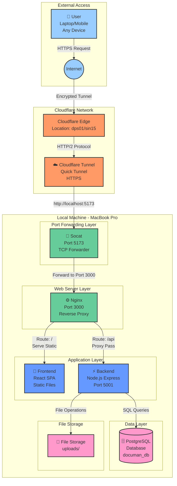
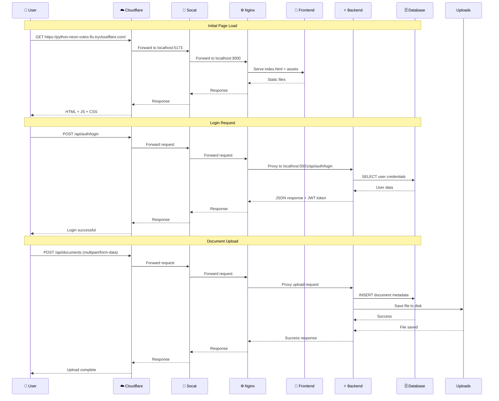
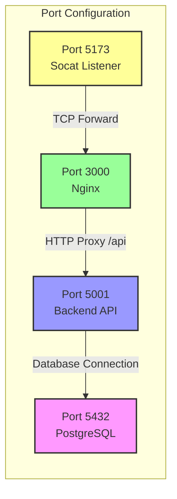
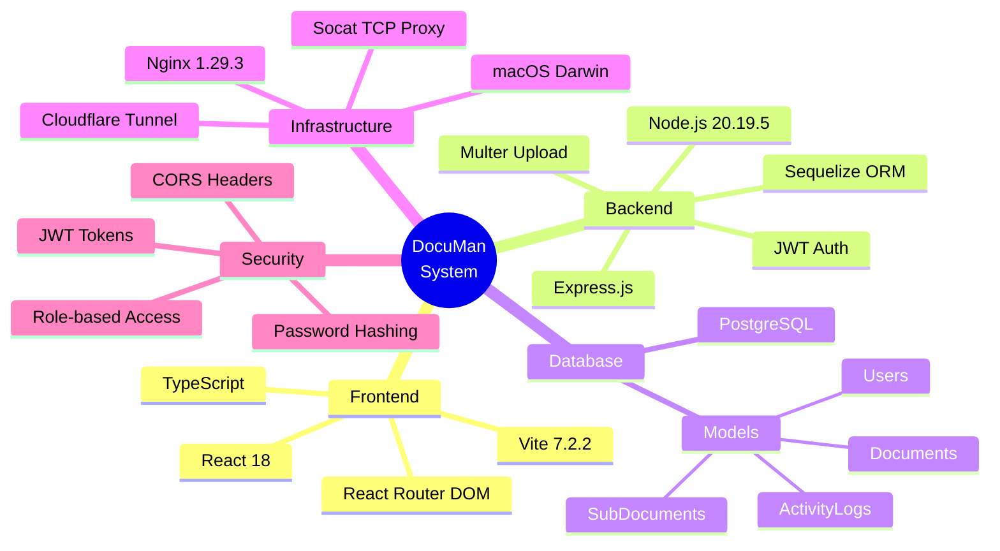
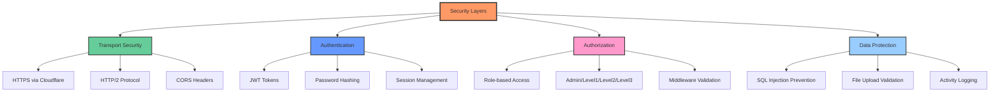

# System Topology - DocuMan Application

## Architecture Diagram

## Network Flow

## Port Mapping

## Technology Stack

## Deployment Architecture

| Component | Technology | Port | Purpose |
|-----------|-----------|------|---------|
| **Public Access** | Cloudflare Tunnel | HTTPS | Public internet gateway |
| **Port Forwarder** | Socat | 5173 | TCP port forwarding |
| **Reverse Proxy** | Nginx | 3000 | Route requests, serve static files |
| **Frontend** | React + Vite Build | - | Single Page Application |
| **Backend API** | Node.js + Express | 5001 | REST API server |
| **Database** | PostgreSQL | 5432 | Data persistence |
| **File Storage** | Local Filesystem | - | Document storage |

## Security Features

## Access Information

**Public URL:** https://python-neon-votes-flu.trycloudflare.com

**Note:** URL changes on every tunnel restart (Quick Tunnel limitation)

**Default Credentials:**
- Username: `admin`
- Password: `admin123`

**Services Status:**
- ✅ Frontend: Running (Static files via Nginx)
- ✅ Backend: Running (Node.js on port 5001)
- ✅ Database: Connected (PostgreSQL)
- ✅ Cloudflare Tunnel: Active
- ✅ Nginx: Running (Port 3000)
- ✅ Socat: Running (Port 5173 → 3000)

---

**Generated:** November 27, 2025
**System:** DocuMan - Document Management System
**Status:** Production Ready ✅
